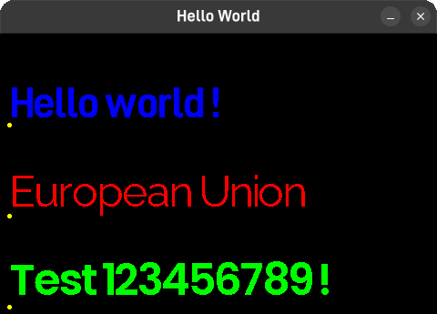

# embedded-graphics-profont
<p align="left">
  <a href="https://crates.io/crates/embedded-graphics-profont"></a>
  <a href="https://docs.rs/embedded-graphics-profont"></a>
  <a href="LICENSE-MIT"></a>
</p>

Bitmap font rendering for `embedded-graphics` with text anchoring and tracking support.



## Quick Start

```rust
use embedded_graphics::{
    pixelcolor::Rgb666,
    prelude::*,
};
use embedded_graphics_profont::{Text, Anchor, WithAnchor};

mod fonts;
use fonts::FONT;

// Render text
let text = Text::new("Hello", Point::new(0, 0), &FONT, Rgb666::BLACK);
display.draw(&text).ok();

// With anchoring and spacing
let text = Text::new("Centered", Point::new(160, 120), &FONT, Rgb666::BLACK)
    .with_anchor(Anchor::MiddleCenter)
    .with_tracking(2);
display.draw(&text).ok();
```

## Features

- `no_std` compatible
- Bitmap fonts (monospace & proportional)
- **9-point text anchoring** (TopLeft, TopCenter, TopRight, MiddleLeft, MiddleCenter, MiddleRight, BottomLeft, BottomCenter, BottomRight)
- **Character tracking** (letter spacing)
- Transparent rendering (only font pixels drawn)
- Text measurement via `font.measure_str()`

## Font Generation

See [TOOLS.md](TOOLS.md) for complete font generation workflow.

**Quick workflow:**
1. Create/edit font in **GLCD Font Creator** 
2. Export as `.c` (Format: MikroC, Method: "Export for tft")
3. Convert with `main.py` → generates `fonts.rs`
4. Copy to project

## API Overview

| Méthod | Description |
| --- | --- |
| `Font::new(lookup_table, data, ascii_begin, ascii_end, max_height, proportional)` | Create font |
| `font.measure_str(text, tracking)` | Get text width in pixels |
| `text.with_anchor(anchor)` | Set anchor point |
| `text.with_tracking(pixels)` | Set letter spacing |
| `Character::new(ch, pos, font, color)` | Render single char |

## Modules

- **`font`** - Font definition, Text, Character, Anchor
- **`renderer`** - Low-level draw_char/draw_str functions

See `cargo doc --open` for full API reference.
